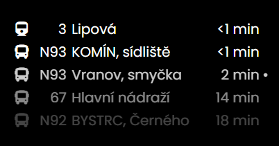

# MMM-idos

This is a Magic Mirror Module (https://github.com/MichMich/MagicMirror/), which displays
real time estimated departures for public transport in the Czech Republic.

*Beware that by using this you might be violating idos.cz ToS*




## Installation

Clone this module into your Magic Mirror modules folder.
1. Go into Magic Mirror's `modules` folder
2. Execute `git clone https://github.com/soyrubio/MMM-idos.git`.

## Using the module

In order to use this module, add the following configuration into Magic Mirror's config file (located in 'config/config.js'):

```js
var config = {
    modules: [
        {
            module: 'MMM-idos',
            header: 'Praha Masarykovo n.', // no header will be displayed if ommited
            position: 'top_right',   // position of the module

            config: {
                stopId: 'Praha%20Masarykovo%20n.', // "https://idos.idnes.cz/vlakyautobusymhdvse/odjezdy/vysledky/?f=the_stop
                torPorts:  ['9050', '9052'], // tor won't be used if ommited
                /* other configurations */
            }
        }
    ]
}
```

If Tor ports are selected, the module will randomly choose one to access to the idos.cz website.
If you want to set up Tor for anonymous access, and don't know how to, [you can read this article](https://levelup.gitconnected.com/anonymous-web-scrapping-with-node-js-tor-apify-and-cheerio-3b36ec6a45dc).

## Configuration options

| Option               | Description
|--------------------- |------------
| `stopId`             | *Required* Id of the stop (parameter "z" in stop's livetable url).<br><br> **Type:** `int` <br> **Default value:** `none`
| `maximumEntries`     | *Optional* The maximum entries shown. <br><br> **Type:** `int` <br> **Default value:** `10`
| `refreshInterval`    | *Optional* How often to check for the next lines. <br><br> **Type:** `int`<br> **Default value:** `60000` milliseconds (60 seconds)
| `fade`               | *Optional* Fade the future lines to black. (Gradient) <br><br> **Type:** `boolean`<br> **Default value:** `true`
| `fadePoint`          | *Optional* Where to start fade? <br><br> **Type:** `float`<br> **Default value:** `0.25` (start on the 1/4 th of the list)
| `blink`      | *Optional* Whether departures should blink when departure time is <1 min.  <br><br> **Type:** `boolean`<br> **Default value:** `true`
| `displaySymbol`      | *Optional* Whether to display bus/tram symbols. <br><br> **Type:** `boolean`<br> **Default value:** `true`
| `displayLineNumber`  | *Optional* Whether to display line number. <br><br> **Type:** `boolean`<br> **Default value:** `true`
| `displayDestination` | *Optional* Whether to display destination stop. <br><br> **Type:** `boolean`<br> **Default value:** `true`
| `torPorts` | *Optional* Tor ports, which will be randomly chosen to access the website, if ommited, Tor won't be used <br><br> **Type:** `array ot strings`<br> **Default value:** `[]`

## Credits

The module is based on the [MMM-imhdsk By Adman](https://github.com/Adman/MMM-imhdsk), his module is far better than my own would be so this is basically the MMM-imhdsk module remade to fetch departures data from the idos.cz website. Thanks Adman!


